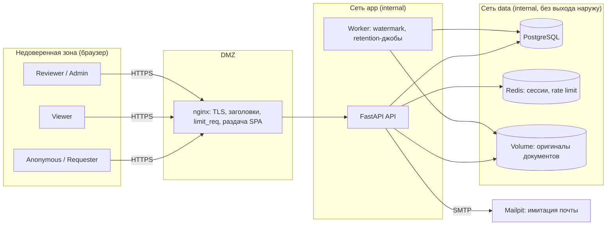
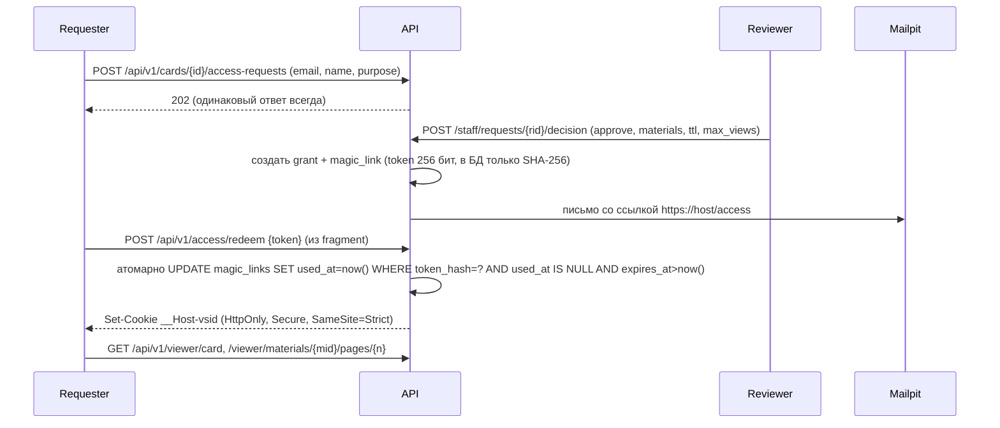

# Design: Controlled Disclosure MVP

## 1. Архитектура

- **Same-origin**: nginx отдаёт SPA с `/` и проксирует `/api/v1/*` → CORS не нужен, cookie `SameSite=Strict`.
- Отдельные docker-сети: `edge` (nginx↔api), `data` (api/worker↔pg/redis), `data` помечена `internal: true`.
- Порты наружу публикует только nginx (443; 8025 Mailpit — только на `127.0.0.1`).
- Watermark и rasterization выполняются синхронно в API для MVP (страниц мало); вынос в worker — опционально.
  Retention-джобы — в worker по расписанию (APScheduler или cron в контейнере).

### Trust boundaries
| ID | Граница | Что проверяем на ней |
|---|---|---|
| TB1 | Браузер → nginx | TLS, размер тела, rate limit, заголовки |
| TB2 | nginx → API | Аутентификация, CSRF, валидация, authorization (всё — в API) |
| TB3 | API → PostgreSQL | Параметризованные запросы, отдельная роль БД с минимальными правами |
| TB4 | API → файловое хранилище | Доступ только по внутреннему ID из БД, никогда по имени из запроса |
| TB5 | API → Mailpit | В письме только одноразовая ссылка, без содержимого карточки |
| TB6 | Staff-зона ↔ публичная зона | Разные cookie/сессии, разные префиксы API (`/api/v1/staff/*`) |

## 2. Модель данных (PostgreSQL)

Все публичные идентификаторы — UUIDv4 (`gen_random_uuid()`); последовательные `bigint` наружу не отдаются.

| Таблица | Ключевые поля | Класс данных |
|---|---|---|
| `cards` | `id uuid`, `status` (draft/published/archived), teaser: `title_generic`, `industry` (enum), `region_macro` (enum), `size_band` (enum), `revenue_band` (enum), `deal_type` (enum), `teaser_text`; confidential: `org_name`, `org_aliases text[]`, `full_description`; `created_by`, `published_at` | Public (teaser) / Confidential |
| `materials` | `id uuid`, `card_id`, `storage_key` (случайное имя), `original_name`, `mime`, `size`, `sha256`, `pages` | Confidential |
| `access_requests` | `id uuid`, `card_id`, `email_enc` (Fernet), `email_hash` (HMAC-SHA256 для rate limit/дедупа), `display_name` (≤ 60), `purpose` (≤ 1000), `status` (pending/approved/rejected/expired/withdrawn), `created_at`, `retain_until` | Personal (synthetic) |
| `decisions` | `id uuid`, `request_id` UNIQUE, `reviewer_id`, `decision`, `reason_code` (enum), `comment_internal`, `decided_at` | Internal |
| `grants` | `id uuid`, `request_id`, `card_id`, `viewer_pseudonym` (напр. `viewer-7F3K`), `material_ids uuid[]`, `allow_download bool`, `expires_at`, `max_views int`, `views_used int`, `revoked_at`, `revoked_by`, `revoke_reason` | Internal |
| `magic_links` | `id uuid`, `grant_id`, `token_hash` (SHA-256), `expires_at`, `used_at`, `used_ip_hash` | Secret (хеш) |
| `staff_users` | `id uuid`, `email`, `password_hash` (argon2id), `totp_secret_enc`, `role` (reviewer/admin), `is_active`, `failed_logins`, `locked_until` | Secret / Internal |
| `audit_events` | `id bigserial`, `ts`, `actor_type`, `actor_ref` (псевдоним/uuid), `action`, `object_type`, `object_id`, `outcome` (allow/deny/error), `ip_hash`, `request_id`, `details jsonb` (без чувствительного), `prev_hash`, `hash` | Internal, append-only |

Сессии — в Redis: `sess:<sha256(sid)>` → `{kind: staff|viewer, subject, grant_id?, created, last_seen}`; индекс
`grant_sessions:<grant_id>` → множество sid для мгновенного отзыва.

### Роли PostgreSQL
- `app_owner` — владелец схемы, используется **только** Alembic-миграциями.
- `app_rw` — роль приложения: CRUD на рабочие таблицы, **только INSERT/SELECT** на `audit_events` (`REVOKE UPDATE, DELETE, TRUNCATE`).
- Триггер `BEFORE UPDATE OR DELETE ON audit_events` → `RAISE EXCEPTION` (вторая линия защиты).

## 3. Матрица доступа

`O` — только свои объекты (object-level), `—` — запрещено (403/404).

| Действие / ресурс | anonymous | viewer | reviewer | admin |
|---|---|---|---|---|
| Список/просмотр teaser (published) | ✓ | ✓ | ✓ | ✓ |
| Отправить запрос доступа | ✓ | ✓ | — | — |
| Просмотр очереди запросов | — | — | ✓ | — (только счётчики) |
| Одобрить/отклонить запрос | — | — | ✓ | — |
| Отозвать grant | — | — | ✓ | ✓ |
| Расширенная карточка | — | O (только card своего grant) | ✓ (read-only) | ✓ |
| Страницы/файлы материалов | — | O (только material_ids grant) | ✓ (без watermark-обхода) | ✓ |
| Скачать watermarked PDF | — | O, если `allow_download` | — | — |
| Создать/редактировать/опубликовать карточку | — | — | — | ✓ |
| Загрузить материалы | — | — | — | ✓ |
| Просмотр audit log | — | — | — | ✓ (read-only) |
| Изменить/удалить audit event | — | — | — | — (никому) |
| Деактивировать staff-аккаунт | — | — | — | ✓ (кроме себя) |

Разделение обязанностей: admin не может одобрять запросы, reviewer не может публиковать карточки.
Отказ в доступе к чужому объекту → **404** (не раскрываем существование), отказ по роли → **403**. Оба события пишутся в аудит.

## 4. Ключевые потоки

### 4.1 Запрос → одобрение → доступ

- Токен в **fragment** (`#t=`) → не попадает в логи nginx, историю proxy и `Referer`. SPA сразу делает
  `history.replaceState` и убирает fragment.
- Ссылка одноразовая, TTL 30 мин; повторное использование → 410 + событие `link.reuse_attempt`.
- Viewer-сессия: idle 15 мин, absolute = min(8 ч, `grant.expires_at`).
- **Каждый** запрос viewer заново проверяет grant в БД (не отозван, не истёк, лимит просмотров) — кеш решения не используется.

### 4.2 Отзыв
`POST /staff/grants/{gid}/revoke` → `revoked_at=now()` + удаление всех sid из `grant_sessions:<gid>` + инвалидация
неиспользованных magic links. Следующий запрос viewer → 401. Целевое время отзыва: < 1 с.

### 4.3 Watermark
- Оригинал PDF не отдаётся никогда. Страница рендерится PyMuPDF в PNG (≤ 150 dpi) и на неё Pillow наносит
  плиточный полупрозрачный текст: `viewer_pseudonym · UTC-время · WM-код`, плюс малозаметная подпись в углу.
- `WM-код` = первые 10 символов base32(HMAC-SHA256(wm_key, grant_id ‖ view_id)) → admin-инструмент
  «Trace watermark» находит grant и событие просмотра по коду со скриншота.
- Содержимое watermark формируется только из данных сервера; параметры запроса на него не влияют (T-11).
- Скачивание (если `allow_download`) — сборка нового PDF из watermarked-страниц (текстовый слой удаляется).
- Ответы: `Cache-Control: no-store`, `Pragma: no-cache`, `Content-Disposition: inline; filename="page.png"`.

### 4.4 Обезличивание teaser
- Поля teaser — только enum-диапазоны (регион — макрорегион, размер/выручка — диапазоны), без свободных чисел.
- `teaser_text` ≤ 600 символов, проходит **линтер утечек** при публикации: блок, если содержит
  `org_name`/`org_aliases` (с нормализацией регистра и транслитерацией), домены, e-mail, телефоны, ИНН/ОГРН/VAT,
  URL. Плюс обязательный чек-лист admin «проверено на идентифицируемость» (фиксируется в аудите).
- Проверка уникальности комбинации: если в каталоге комбинация (`industry`, `region_macro`, `size_band`,
  `revenue_band`) встречается 1 раз — предупреждение admin (k-anonymity по каталогу, k=2; на синтетике — демонстрационно).

## 5. Threat model (STRIDE)

Приоритет: H/M/L = вероятность × ущерб.

| ID | STRIDE | Угроза | Приор. | Контроль (SR) | Тест |
|---|---|---|---|---|---|
| T-01 | I | Enumeration и массовая выгрузка каталога | M | SR-01, SR-02, SR-25 | TC-CAT-03 |
| T-02 | I | Реидентификация организации по комбинации полей teaser | H | SR-03, SR-04 | TC-CARD-04 |
| T-03 | E/I | IDOR/BOLA: viewer открывает чужую карточку/материал/решение подменой ID | H | SR-10, SR-11 | TC-VIEW-05..07 |
| T-04 | S | Повторное использование или пересылка одноразовой ссылки | H | SR-12, SR-13 | TC-LINK-02..04 |
| T-05 | S | Перебор токенов ссылок | M | SR-12, SR-25 | TC-LINK-05 |
| T-06 | E | Доступ после отзыва/истечения grant (живая сессия) | H | SR-14 | TC-VIEW-08 |
| T-07 | E | Vertical escalation anonymous→viewer→reviewer→admin через API | H | SR-15, SR-16 | TC-RBAC-01..05 |
| T-08 | E | Mass assignment (`status`, `role`, `grant_id` в теле запроса) | M | SR-17 | TC-API-02 |
| T-09 | T | XSS/инъекции через `purpose`, `display_name`, `teaser_text` | M | SR-18, SR-19, SR-20 | TC-API-03, TC-FE-01 |
| T-10 | I | Утечка закрытого URL/токена через Referer, логи, ошибки | H | SR-12, SR-21, SR-22 | TC-LEAK-01..03 |
| T-11 | T | Подмена/удаление watermark (параметры, прямой доступ к оригиналу) | M | SR-23, SR-24 | TC-WM-01..03 |
| T-12 | I | Cache leakage (браузер, proxy) расширенного содержимого | M | SR-22 | TC-LEAK-04 |
| T-13 | R | Отрицание действий reviewer/admin; скрытое удаление событий аудита | M | SR-26, SR-27 | TC-AUD-02..03 |
| T-14 | S | Подбор/угон пароля staff, фиксация сессии | H | SR-15, SR-30, SR-31 | TC-AUTH-01..05 |
| T-15 | T | CSRF на staff-действиях (approve, revoke, publish) | M | SR-19 | TC-API-04 |
| T-16 | D | Флуд запросов доступа / спам reviewer, DoS на рендер страниц | M | SR-25 | TC-RL-01..02 |
| T-17 | I | Утечка данных requester (e-mail) из БД/бэкапа/логов | M | SR-28, SR-21 | TC-LEAK-05 |
| T-18 | T | Гонка: отзыв во время redeem, двойной redeem, лимит просмотров | M | SR-13, SR-14 | TC-RACE-01..02 |
| T-19 | I | Скриншот/запись экрана одобренным viewer | H | SR-23 (только сдерживание) | — (остаточный риск) |
| T-20 | E | Компрометация секретов (ключи Fernet/HMAC/сессий) в репо/образе | M | SR-32, SR-33 | CI secret scan |

## 6. Security requirements

| SR | Требование |
|---|---|
| SR-01 | Публичные ID — UUIDv4; последовательные ID наружу не отдаются |
| SR-02 | Каталог: пагинация ≤ 20, нет параметров выборки «всё», rate limit на IP |
| SR-03 | Teaser-поля — только enum-диапазоны; линтер утечек блокирует публикацию |
| SR-04 | Предупреждение при уникальной комбинации квазиидентификаторов |
| SR-10 | Object-level authorization на каждом viewer-эндпоинте: card_id и material_id ∈ grant |
| SR-11 | Чужой объект → 404 с тем же телом, что и несуществующий |
| SR-12 | Токен ссылки ≥ 256 бит (`secrets.token_urlsafe(32)`), в БД только SHA-256, передача через fragment, TTL 30 мин |
| SR-13 | Redeem атомарный и одноразовый; повтор → 410 + аудит |
| SR-14 | Проверка grant (revoked/expired/views) на каждом запросе; отзыв удаляет все сессии grant |
| SR-15 | Staff: argon2id + обязательный TOTP; блокировка после 5 неудач на 15 мин |
| SR-16 | RBAC проверяется декоратором/dependency на сервере для каждого маршрута; deny by default |
| SR-17 | Pydantic-схемы с `extra="forbid"`; серверные поля не принимаются из тела |
| SR-18 | Валидация длины/алфавита на сервере; вывод в React без `dangerouslySetInnerHTML` |
| SR-19 | CSRF: double-submit token для всех state-changing запросов + `SameSite=Strict` |
| SR-20 | Строгий CSP без `unsafe-inline`/`unsafe-eval` |
| SR-21 | Логи без токенов, e-mail, содержимого карточек; редактирование по allowlist полей |
| SR-22 | `Cache-Control: no-store` на всех не-публичных ответах; `Referrer-Policy: no-referrer` |
| SR-23 | Персональный watermark на каждом отданном изображении/PDF, формируется только на сервере |
| SR-24 | Оригиналы материалов недоступны ни по какому URL; доступ к хранилищу только по `storage_key` из БД |
| SR-25 | Rate limiting: каталог, запросы доступа, redeem, логин, рендер страниц (значения — в platform-security) |
| SR-26 | Audit trail для запросов, решений, просмотров, скачиваний, отказов, отзывов, логинов |
| SR-27 | Audit append-only на уровне прав БД + триггер + hash-цепочка с проверкой |
| SR-28 | E-mail requester шифруется (Fernet), для поиска — HMAC; в аудите — только псевдоним |
| SR-30 | Session ID ≥ 128 бит, ротация при логине, `__Host-` cookie, HttpOnly, Secure, SameSite=Strict |
| SR-31 | Idle/absolute таймауты сессий; logout инвалидирует на сервере |
| SR-32 | Секреты только из env/docker secrets; `.env` в `.gitignore`; gitleaks в CI и pre-commit |
| SR-33 | Контейнеры: non-root, read-only rootfs где возможно, минимальные образы, pinned зависимости |

## 7. Маппинг на OWASP ASVS 5.0.0 (≥ 20 требований)

> Точные идентификаторы `v5.0.0-x.y.z` сверить по официальному тексту ASVS 5.0.0 перед сдачей и вписать в колонку ID.
> Главы ниже — по структуре ASVS 5.0.

| # | Глава ASVS 5.0 | Суть требования | SR | ID (заполнить) |
|---|---|---|---|---|
| 1 | V1 Encoding & Sanitization | Контекстное экранирование вывода | SR-18 | |
| 2 | V1 | Параметризованные запросы к БД | SR-17 | |
| 3 | V2 Validation & Business Logic | Серверная валидация по allowlist | SR-18 | |
| 4 | V2 | Защита бизнес-потока от автоматизации (rate limits) | SR-25 | |
| 5 | V2 | Последовательность шагов бизнес-логики не обходится (redeem до просмотра) | SR-13 | |
| 6 | V3 Web Frontend Security | CSP | SR-20 | |
| 7 | V3 | Cookie `__Host-`, Secure, HttpOnly, SameSite | SR-30 | |
| 8 | V3 | Referrer-Policy, frame-ancestors, nosniff | SR-22 | |
| 9 | V3 | CSRF-защита | SR-19 | |
| 10 | V4 API & Web Service | Запрет mass assignment / лишних полей | SR-17 | |
| 11 | V5 File Handling | Файлы не исполняются и не отдаются напрямую; безопасное имя | SR-24 | |
| 12 | V5 | Проверка типа и размера загружаемых файлов | SR-24 | |
| 13 | V6 Authentication | Хранение паролей (argon2id) | SR-15 | |
| 14 | V6 | MFA для привилегированных пользователей | SR-15 | |
| 15 | V6 | Защита от перебора | SR-15, SR-25 | |
| 16 | V7 Session Management | Новый session ID при аутентификации | SR-30 | |
| 17 | V7 | Таймауты и серверная инвалидация | SR-31 | |
| 18 | V7 | Завершение всех сессий при отзыве доступа | SR-14 | |
| 19 | V8 Authorization | Deny by default, проверка на сервере | SR-16 | |
| 20 | V8 | Object-level authorization (BOLA) | SR-10 | |
| 21 | V11 Cryptography | Только проверенные библиотеки, CSPRNG | SR-12 | |
| 22 | V13 Configuration | Секреты вне кода/образов | SR-32 | |
| 23 | V14 Data Protection | Отсутствие кеширования чувствительных данных | SR-22 | |
| 24 | V14 | Минимизация данных и retention | data-retention | |
| 25 | V16 Logging & Error Handling | Журнал событий безопасности без чувствительных данных | SR-21, SR-26 | |
| 26 | V16 | Защита журнала от изменения | SR-27 | |
| 27 | V16 | Общие сообщения об ошибках без деталей | SR-21 | |

## 8. Data classification и retention

| Данные | Класс | Где | Срок хранения | Удаление |
|---|---|---|---|---|
| Teaser-поля | Public | `cards` | Пока карточка опубликована | Archive admin'ом |
| Confidential-поля карточки | Confidential | `cards` | Срок жизни карточки | Ручное, admin |
| Оригиналы материалов | Confidential | volume | Срок жизни карточки | Ручное + удаление файла |
| E-mail, имя, цель requester | Personal (synth) | `access_requests` | Rejected — 30 дн., approved — 30 дн. после истечения grant | Автоджоба: обнуление полей, статус `purged` |
| Magic link | Secret | `magic_links` | 30 мин (TTL) | Автоджоба: удалить через 24 ч |
| Grant | Internal | `grants` | 90 дн. после истечения | Автоджоба |
| Сессии | Secret | Redis | TTL сессии | Redis TTL |
| Audit events | Internal | `audit_events` | 1 год (демо: не удаляется) | Не удаляется приложением |
| Логи приложения | Internal | stdout/docker | 7 дн. (`max-file`/`max-size`) | Ротация docker |

Для демонстрации retention-джобы можно запустить вручную: `make retention-run` с флагом `--now-offset=31d`.

## 9. Decision log

| ID | Решение | Почему | Альтернатива |
|---|---|---|---|
| D-01 | FastAPI + Pydantic v2 | Рекомендация брифа (Python), OpenAPI из коробки, `extra=forbid` | Django + DRF |
| D-02 | Серверные сессии в Redis, не JWT | Мгновенный отзыв (T-06) без blacklist | JWT + denylist |
| D-03 | Токен ссылки во fragment | Не попадает в логи и Referer (T-10) | Query string + немедленный редирект |
| D-04 | Растеризация страниц вместо отдачи PDF | Оригинал не покидает сервер, watermark нельзя срезать как слой (T-11) | PDF.js + наложение |
| D-05 | Staff: пароль + TOTP на проверенных библиотеках | Требование брифа не писать аутентификацию самим | Keycloak (тяжелее для пары за месяц) |
| D-06 | 404 для чужих объектов | Не раскрывать существование (T-03) | 403 |
| D-07 | Mailpit вместо почты | Бриф разрешает имитацию; удобно на демо | Логирование ссылки (запрещено SR-21) |

## 10. Остаточные риски (для residual risk statement)

1. Скриншот/запись экрана/фото экрана одобренным viewer — не предотвращается; watermark лишь сдерживает и позволяет отследить источник.
2. Пересылка ссылки **до** первого использования — получатель войдёт вместо адресата; смягчение: короткий TTL, одноразовость, видимость в аудите (IP-хеш, user-agent), отзыв.
3. Компрометация почтового ящика requester → доступ к ссылке.
4. Watermark на растре можно частично удалить ретушью; HMAC-код повторяется плиткой для устойчивости.
5. Обезличивание на синтетике не доказывает устойчивость к реидентификации на реальных данных; нужна профильная экспертиза.
6. MVP без WAF, HSM, бэкапов с шифрованием, мониторинга — вне scope тестового стенда.

## 11. Каталог событий аудита

| Группа | События |
|---|---|
| Запросы | `request.created`, `request.duplicate`, `request.rate_limited` |
| Решения | `decision.approved`, `decision.rejected` |
| Grants | `grant.created`, `grant.revoked`, `grant.expired`, `grant.views_exhausted` |
| Ссылки | `link.issued`, `link.reissued`, `link.redeemed`, `link.reuse_attempt`, `link.expired_attempt`, `link.bruteforce_suspected` |
| Материалы | `material.page_viewed`, `material.downloaded`, `material.download_denied`, `material.upload_rejected`, `material.deleted` |
| Карточки | `card.created`, `card.updated`, `card.published`, `card.archived`, `card.publish_k_warning_ack` |
| Аутентификация | `auth.login_success`, `auth.login_failed`, `auth.locked`, `auth.logout`, `session.invalid` |
| Авторизация | `authz.denied`, `catalog.rate_limited` |
| Администрирование | `staff.deactivated`, `staff.activated`, `audit.exported`, `retention.purged` |

## 12. Лимиты (rate limiting)

| Эндпоинт | Лимит |
|---|---|
| `GET /api/v1/cards*` | 60/мин на IP |
| `POST /api/v1/cards/{id}/access-requests` | 5/ч на IP, 3/сут на e-mail (HMAC) |
| `POST /api/v1/access/redeem` | 10 неудач / 10 мин на IP |
| `POST /api/v1/staff/auth/login` | 10/мин на IP + lockout аккаунта после 5 неудач на 15 мин |
| `GET /api/v1/viewer/materials/{mid}/pages/{n}` | 120/мин на сессию |
| nginx `client_max_body_size` | 11m для upload-маршрута, 64k для остальных |
